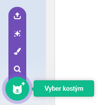

Klikni na záložku **kostýmy** a poté na **vybrat kostým** a přidej postavě libovolný kostým z knihovny kostýmů:

Umísti přidaný kostým do editoru Malování a změň jeho velikost tak, aby odpovídala dalším kostýmům postavy.

**Tip:** Pokud umístíš postavu na Scénu, a potom změníš její kostýmy, může se zdát, že postava "skáče" nebo mění velikost. Umísti kostýmy a uprav jejich velikosti v editoru Malování tak, aby se se všechny zobrazili na Scéně ve správné pozici.

