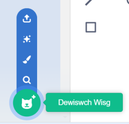

Cliciwch ar y tab **Gwisgoedd** ac yna ar **Dewiswch Wisg** i ychwanegu unrhyw wisg at y corlun o'r Llyfrgell Gwisgoedd:

Bydd angen i ti leoli a newid maint y wisg ychwanegol yn y golygydd Paent, i gyd-fynd â gwisgoedd eraill y corlun.

**Awgrym:** Os wyt ti'n gosod corlun ar y Llwyfan ac yna'n newid ei wisg, efallai bydd y corlun yn edrych fel petai'n 'neidio' neu'n newid maint. Bydd angen i ti leoli a newid maint y gwisgoedd yn y golygydd Paent fel eu bod i gyd yn ymddangos yn y safle cywir ar y Llwyfan.

