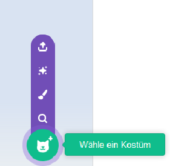

Klicke auf den Reiter **Kostüme** und dann auf **Wähle ein Kostüm**, um der Figur ein beliebiges Kostüm aus der Kostümbibliothek hinzuzufügen:

Positioniere das hinzugefügte Kostüm und ändere seine Größe im Mal-Editor so, dass es zu den anderen Kostümen der Figur passt.

**Tipp:** Wenn Du eine Figur auf die Bühne stellst und dann ihr Kostüm änderst, kann es vorkommen, dass die Figur „springt“ oder ihre Größe ändert. Du musst die Kostüme im Mal-Editor positionieren und ihre Größe ändern, damit sie alle an der richtigen Position auf der Bühne erscheinen.

