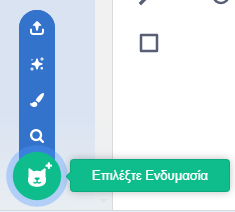

Κάνε κλικ αρχικά στην καρτέλα **Ενδυμασίες** και κατόπιν στο **Επιλέξτε Ενδυμασία** για να προσθέσεις μια ενδυμασία στο αντικείμενό σου από την Συλλογή Ενδυμασιών:

Θα πρέπει να τοποθετήσεις και να αλλάξεις το μέγεθος των ενδυμασιών που προστέθηκαν, στον Επεξεργαστή ζωγραφικής για να ταιριάζει με τις άλλες ενδυμασίες του αντικειμένου σου.

**Συμβουλή:** Εάν τοποθετήσεις ένα αντικείμενο στη σκηνή και μετά του αλλάξεις ενδυμασία, το αντικείμενο μπορεί να φαίνεται να "πηδά" ή να αλλάζει μέγεθος. Θα χρειαστεί να τοποθετήσεις και να αλλάξεις το μέγεθος των ενδυμασιών στον Επεξεργαστή ζωγραφικής έτσι ώστε να εμφανίζονται όλα στη σωστή θέση στη σκηνή.
