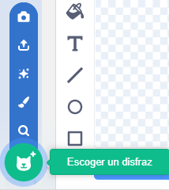

Haz clic en la pestaña **Disfraces** y luego en **Escoger un disfraz** para añadle cualquiera al objeto desde la Biblioteca:

Deberás posicionar y cambiar el tamaño del disfraz añadido en el Editor de dibujo, para que coincida con los otros disfraces del objeto.

**Consejo:** Si colocas un objeto en el Escenario y luego cambias de disfraz, es posible que el mismo parezca "saltar" o cambiar de tamaño. Deberás posicionar y cambiar el tamaño de los disfraces en el Editor de dibujo para que todos aparezcan en la posición correcta en el escenario.

