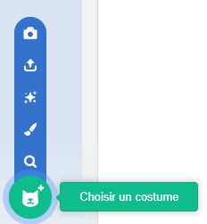

Clique sur l'onglet **Costumes** puis sur **Choisir un costume** pour ajouter n'importe quel costume au sprite.

Tu devras positionner et redimensionner les costumes ajoutés dans l'**éditeur de peinture** pour qu'ils correspondent à tes autres costumes.

**Astuce :** Si tu places un sprite sur la scène et ensuite que tu changes de costume, le sprite peut sembler « sauter » ou changer de taille. Tu devras positionner et redimensionner les costumes dans l'**éditeur de peinture** afin qu'ils apparaissent tous à la bonne position sur la scène.

