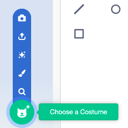

Click on the **Costumes** tab and then on **Choose a Costume** to add any costume to the sprite from the Costume Library:

You will need to position and resize the added costume in the Paint editor, to match the sprite's other costumes.

**Tip:** If you position a sprite on the Stage and then change its costume, the sprite might appear to 'jump' or change size. आपको पेंट संपादक में पोशाकों की स्थिति और आकार बदलने की आवश्यकता होगी ताकि वे सभी मंच पर सही स्थिति में दिखाई दें।

