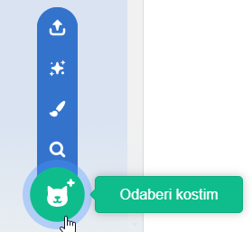

Klikni na karticu **Kostimi**, a zatim na **Odaberi kostim** da liku dodaš bilo koji kostim iz Biblioteke kostima:

Morati ćeš pozicionirati kostim i promijeniti mu veličinu u Paint uređivaču kako bi odgovarao drugim kostimima lika.

**Savjet:** ako postaviš lika na pozornicu i zatim mu promijeniš kostim, može ti se činiti kao da lik skače ili mijenja veličinu. Morati ćeš pozicionirati kostime i promijeniti im veličinu u Paint uređivaču tako da se svi kostimi pojave na pravom mjestu na pozornici.

