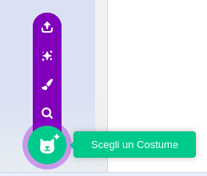

Fai clic sulla scheda **Costumi** e poi su **Scegli un Costume** per aggiungere qualsiasi costume allo sprite dalla libreria dei costumi:

Dovrai posizionare e ridimensionare il costume aggiunto nell'editor Paint, in modo che corrisponda agli altri costumi dello sprite.

**Suggerimento:** Se posizioni uno sprite sullo Stage e poi cambi il suo costume, lo sprite potrebbe sembrare 'saltare' o cambiare dimensione. Dovrai posizionare e ridimensionare i costumi nell'editor di Paint in modo che appaiano tutti nella giusta posizione sullo Stage.

