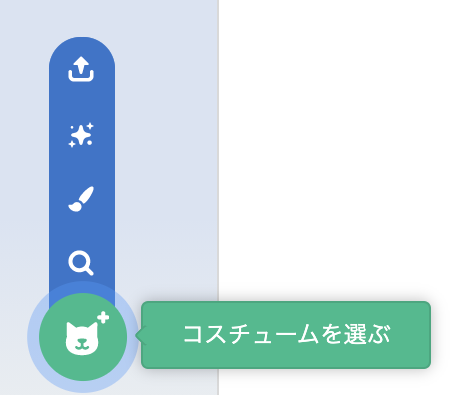

**コスチューム** タブをクリックし、 **コスチュームを選ぶ** を選択して、コスチュームライブラリからスプライトにコスチュームを追加します。

スプライトの他のコスチュームと一致するように、ペイントエディタで追加したコスチュームの位置とサイズを変更する必要があります。

**ヒント：** ステージにスプライトを配置してからコスチュームを変更すると、スプライトが「ジャンプ」したり、サイズが変わったように見える場合があります。 ペイントエディタでコスチュームの位置とサイズを変更して、すべてのコスチュームがステージ上の正しい位置に表示されるようにする必要があります。

