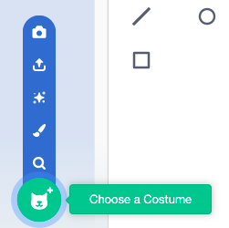

ಕಾಸ್ಟ್ಯೂಮ್ ಲೈಬ್ರರಿಯಿಂದ ಸ್ಪ್ರೈಟ್‌ಗೆ ಯಾವುದೇ ವೇಷಭೂಷಣವನ್ನು ಸೇರಿಸಲು **Costumes** ಟ್ಯಾಬ್ ಮೇಲೆ ಕ್ಲಿಕ್ ಮಾಡಿ ಮತ್ತು ನಂತರ **Choose a Costume** ಕ್ಲಿಕ್ ಮಾಡಿ:

ಸ್ಪ್ರೈಟ್‌ನ ಇತರ ವೇಷಭೂಷಣಗಳನ್ನು ಹೊಂದಿಸಲು ನೀವು ಪೇಂಟ್ ಎಡಿಟರ್‌ನಲ್ಲಿ ಸೇರಿಸಿದ ವೇಷಭೂಷಣವನ್ನು ಇರಿಸಬೇಕು ಮತ್ತು ಮರುಗಾತ್ರಗೊಳಿಸಬೇಕು.

**ಸಲಹೆ:** ನೀವು ವೇದಿಕೆಯಲ್ಲಿ ಸ್ಪ್ರೈಟ್ ಅನ್ನು ಇರಿಸಿದರೆ ಮತ್ತು ನಂತರ ಅದರ ಉಡುಪನ್ನು ಬದಲಾಯಿಸಿದರೆ, ಸ್ಪ್ರೈಟ್ 'ಜಂಪ್' ಅಥವಾ ಗಾತ್ರವನ್ನು ಬದಲಾಯಿಸುವಂತೆ ಕಾಣಿಸಬಹುದು. ನೀವು ಪೇಂಟ್ ಎಡಿಟರ್‌ನಲ್ಲಿ ವೇಷಭೂಷಣಗಳು ಸರಿಯಾದ ಸ್ಥಾನದಲ್ಲಿ ಕಾಣಿಸಿಕೊಳ್ಳಲು ಅದರ ಸ್ಥಾನ ಮತ್ತು ಮರುಗಾತ್ರಗೊಳಿಸ ಬೇಕಾಗಬಹುದು.

