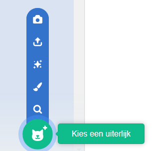

Click on the **Costumes** tab and then on **Choose a Costume** to add any costume to the sprite from the Costume Library:

You will need to position and resize the added costume in the Paint editor, to match the sprite's other costumes.

**Tip:** Als je een sprite op een bepaalde plaats op het Speelveld hebt staan en dan het uiterlijk verandert, kan het lijken of de sprite 'springt' of van grootte verandert. Je zult de plaats en grootte van de toegevoegde uiterlijken in de **Teken-editor** moeten aanpassen zodat het op de juiste plek op het Speelveld komt te staan.

