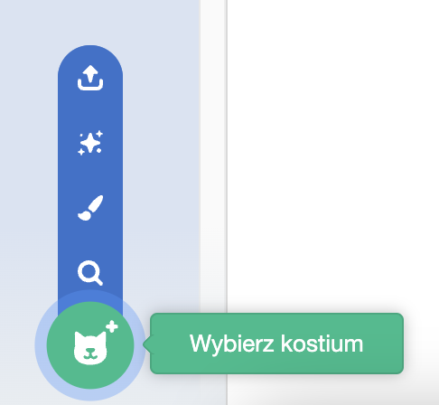

Kliknij zakładkę **Kostiumy**, a następnie **Wybierz kostium**, aby dodać dowolny kostium do duszka z Biblioteki kostiumów:

Będziesz musiał ustawić i zmienić rozmiar dodanego kostiumu w edytorze Paint, aby pasował do innych kostiumów duszka.

**Wskazówka:** Jeśli umieścisz duszka na scenie, a następnie zmienisz jego kostium, duszek może „skakać” lub zmieniać rozmiar. Będziesz musiał ustawić i zmienić rozmiar kostiumów w edytorze Paint, aby wszystkie były wyświetlane we właściwej pozycji na scenie.

