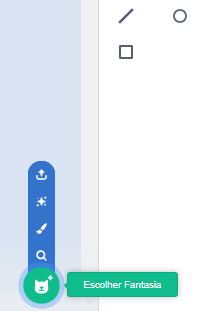

Clique na aba **Fantasias** e em seguida em **Escolher Fantasia** para adicionar uma fantasia ao ator:

Você precisará posicionar e redimensionar as fantasias adicionadas no Editor Paint para combinar com suas outras fantasias.

**Dica:** Se você posicionar um ator no Palco e em seguida mudar de fantasia, o ator pode parecer "pular" ou mudar de tamanho. Você precisará posicionar e redimensionar as fantasias no Editor Paint para que todos apareçam na posição correta no Palco.
