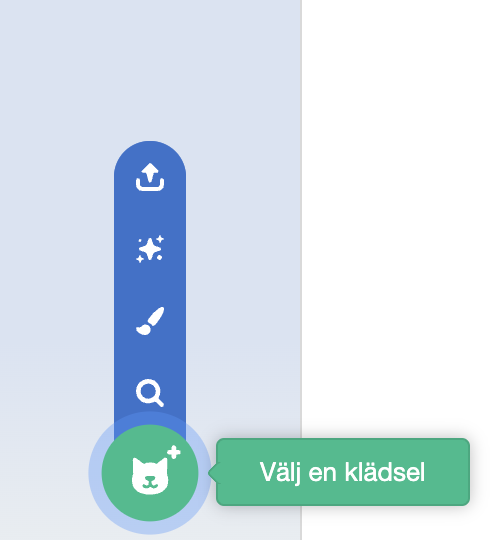

Klicka på **Klädsel**fliken och sedan på **Välj en klädsel** för att lägga till valfri klädsel till sprajten från klädselbiblioteket:

Du måste placera och ändra storlek på den tillagda klädseln i målarredigeraren för att matcha sprajtens andra klädslar.

**Tips:** Om du placerar en sprajt på scenen och sedan byter dess klädsel, kan sprajten se ut att "hoppa" eller ändra storlek. Du måste placera och ändra storlek på klädslarna i målarredigeraren så att de alla visas på rätt plats på scenen.

