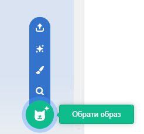

Натисни на вкладку **Образи**, а потім на **Обрати образ**, щоб додати спрайту будь-який образ з Бібліотеки Образів:

Тобі потрібно буде розташувати та змінити розмір доданого образу в редакторі Малювання, щоб він відповідав іншим образам спрайта.

**Порада:** Якщо ти розмістиш спрайт на Сцені, а потім зміниш його образ, спрайт можливо буде 'стрибати' або змінювати свій розмір. Тобі потрібно буде розташувати та змінити розмір образів у редакторі Малювання так, щоб всі образи відображалися у правильному положенні на Сцені.

